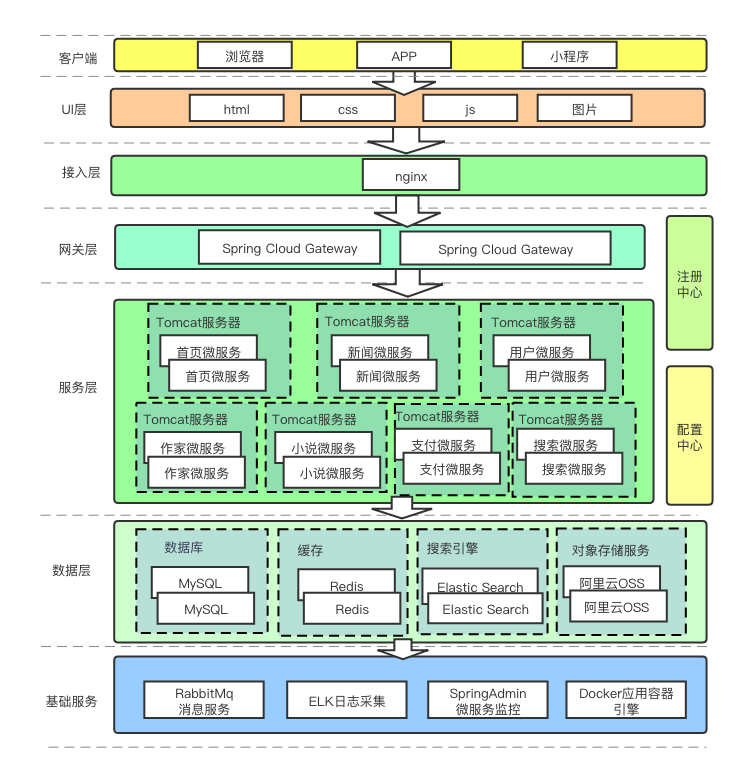
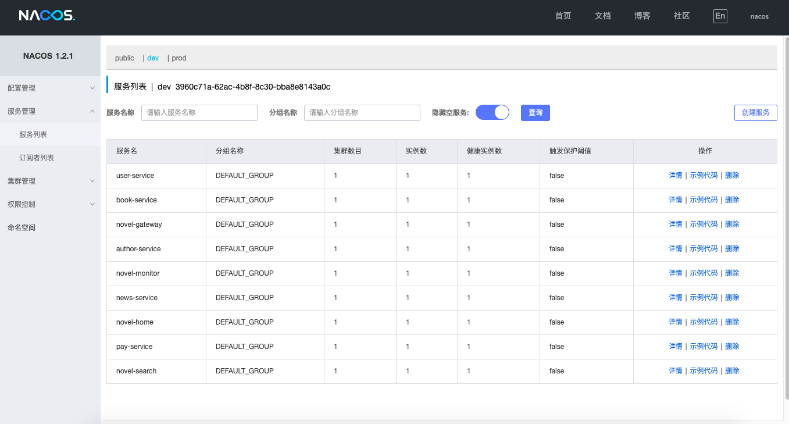
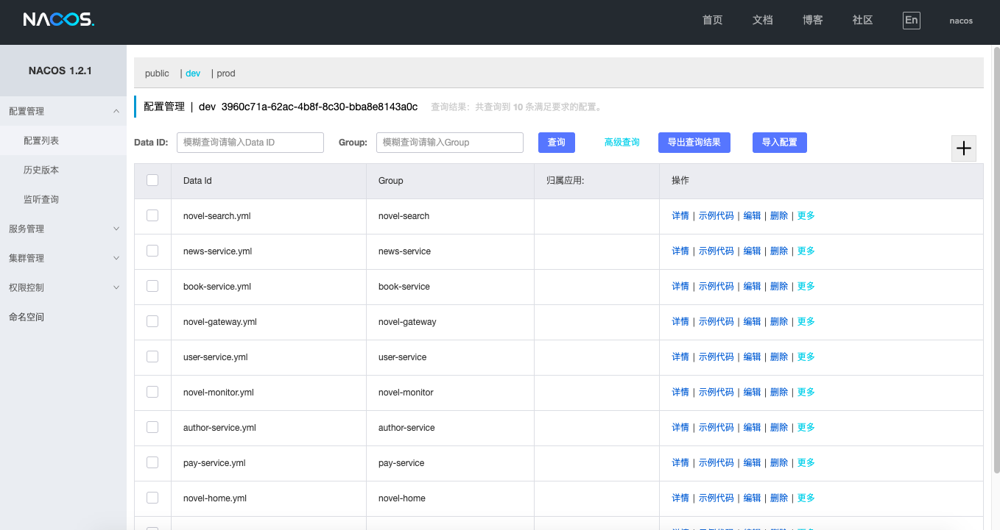
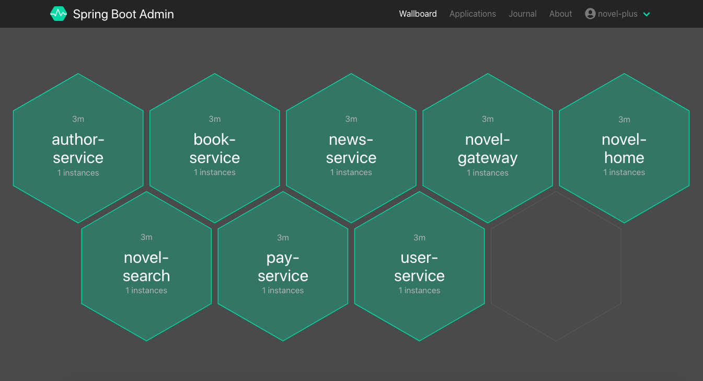
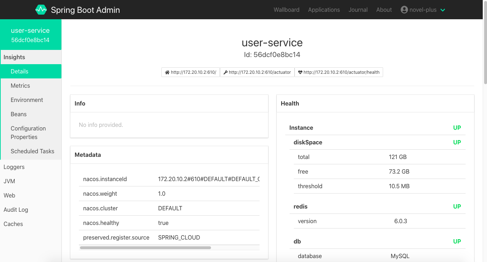

# novel-cloud

#### 介绍
基于[小说精品屋-plus](https://www.oschina.net/p/novel-plus)构建的Spring Cloud 微服务小说门户平台，可用于学习和商用。采用了Spring Boot 2 、Spring Cloud Greenwich、 MyBatis3DynamicSql、Redis、Mq、Elasticsearch、Docker等流行技术，集成了Nacos注册中心/配置中心、Spring Cloud Gateway网关、Spring Boot Admin监控中心等基础服务。前端计划使用Vue开发，目前还在 **<u>开发中</u>**，感兴趣的可以提前关注。

#### 演示地址

[点击前往](http://www.java2nb.com/)（前台门户）

#### 软件架构




#### 项目结构

```
novel-cloud
├── novel-common -- 通用模块，供其他业务微服务模块依赖
├── novel-gen -- 持久层代码生成器，集成Swagger
├── novel-gateway -- 基于Spring Cloud Gateway构建的网关服务
├── novel-monitor -- 基于Spring Boot Admin构建的监控中心
├── novel-search -- 基于Elastic Search构建的搜索微服务
├── novel-home -- 门户首页微服务
├── novel-news -- 新闻中心微服务
├── novel-user -- 用户中心微服务
├── novel-author -- 作家中心微服务
├── novel-book -- 小说微服务
└── novel-pay -- 支付微服务
```

#### 技术选型

| 技术                 | 说明                                                         

| -------------------- | ---------------------------

| SpringBoot           | Spring应用快速开发脚手架     

| SpringCloud          | 微服务架构解决方案 

| Nacos          | 注册中心和配置中心

| SpringCloud Gateway          | 微服务网关

| SpringBoot Admin          | 微服务监控

| MyBatis              | 持久层ORM框架 

| MyBatis Dynamic SQL  | Mybatis动态sql

| PageHelper           | MyBatis分页插件

| MyBatisGenerator     | 持久层代码生成插件

| Seata        | 分布式事务中间件

| Sharding-Jdbc        | 代码层分库分表中间件

| JJWT                 | JWT登录支持  

| Redis                | 分布式缓存                              

| ElasticSearch        | 搜索引擎                

| RabbitMq             | 消息队列

| OSS                  | 阿里云对象存储服务   

| Mysql                | 数据库服务                 

| Redisson             | 实现分布式锁                                       

| Lombok               | 简化对象封装工具  

| Swagger               | API文档生成工具                                                                              

| Docker               | 应用容器引擎   

| ELK               | 分布式日志分析   

| Vue            | 前端开发框架


#### 截图

1. 注册中心截图



2. 配置中心截图

   

3. 监控中心截图

   

   

   4. 门户网站

      

      

#### 项目文档

敬请期待。。。。